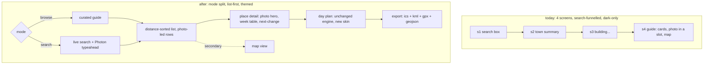
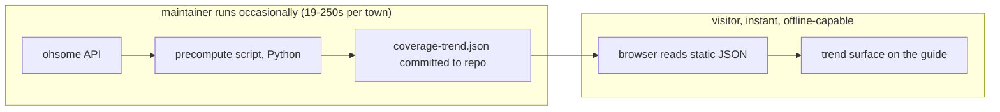

# feat: tripkit UI overhaul and OSM feature-adoption pass

## Summary

tripkit is a no-backend browser travel guide (v0.10.0, MIT) that shows what is open right
now in a town and builds a day around opening hours. It works, and its owner considers the
core complete. Two things remain. First, the interface looks minimal to the point that the
owner calls it unfinished, and photographs the app already fetches are hidden in a tab.
Second, a completed research pass across the OpenStreetMap ecosystem surfaced a set of
adoptable features and free data signals the app currently ignores.

This plan does two things, in order. Part 1 rebuilds the visual language and the
information architecture of the four screens so the product looks like a product: a light
and dark theme both defined, photos leading rather than buried, a distance-sorted list as
the primary near-me surface with the map secondary, and curated-guide browsing split from
live search. Part 2 adopts ten researched features, each independently shippable, ranging
from near-free wins already latent in data the app receives (point-in-time filtering,
Nominatim ranking, Photon typeahead, multi-format export) to the project's single most
distinctive asset, an opening-hours coverage trend over time that no other tool in the
ecosystem shows.

The hard constraints never move: no backend, no account, no API key, no build step for the
runtime, plain CSS and vanilla JS only, theme-aware, mobile-first, and it must keep working
offline for towns already opened. One decision is settled up front and load-bearing:
tripkit does not adopt the `opening_hours.js` library. It copies the library's one good
idea (ask for a week of intervals at once) onto the existing hand-rolled parser at zero
added bytes, and keeps the parser's India-honest refusal behaviour, because the library is
4.4 times the size of the entire app and has no India holiday data at all.

UI lands first because it is the owner's stated pain and because every later feature renders
into it. After the UI, features are sequenced cheapest-and-safest first so each one ships on
its own and the work can stop cleanly at any point with value already delivered.

---

## Problem Frame

Two distinct problems, one codebase.

**The interface reads as unfinished.** The owner's own words, earlier: the UI is "tatti",
too minimal, has no photos, and does not look like a SaaS product. This is not a vague taste
complaint; it is specific and verifiable. Photos are genuinely fetched from Wikimedia
Commons (`docs/app.js` `attachPhotos`) and then rendered only inside a media slot on a card
rather than leading the experience. The theme is dark-only despite the project describing
itself as theme-aware: `docs/style.css` `:root` defines roughly 19 colour tokens but there
is no light palette, no `prefers-color-scheme` block, and no `data-theme` override, so a
daytime user on a light-set device gets a dark app with no way back. The app has four
screens (search, clock, build, guide) whose structure has never been revisited since the
tool was a single-purpose page.

**The app ignores data and patterns already within reach.** A completed research pass found
that: Nominatim returns an `importance` score and `place_rank` on every geocode the app
already makes, and both are discarded; the ranking engine already accepts a time argument,
so ranking for any chosen time rather than only "now" is nearly free; Photon (already used
as a geocoding fallback) is built for as-you-type typeahead where Nominatim's public API is
not; OSM's full edit history is queryable through the ohsome API, which lets the app show
whether a town's opening-hours coverage is improving over time, a genuinely distinctive
surface; and several ecosystem apps demonstrate portable patterns (a distance-sorted
near-me list, a curated-vs-live mode split, buffer-region prefetching to cut Overpass calls,
multi-format place-list export).

The plan addresses both without loosening a single one of the app's defining constraints.

---

## Requirements

Product-level requirements. Each carries a stable R-ID. Implementation Units cite these.

**UI (Part 1)**

- **R1** — A light theme and a dark theme are both fully defined. The app honours the
  viewer's `prefers-color-scheme` by default and offers an explicit in-app toggle whose
  choice persists. No colour is defined only inside a media query.
- **R2** — Photographs the app already fetches lead the visual presentation of a place
  rather than being confined to a secondary slot, wherever a photo exists. A place with no
  photo degrades to a designed placeholder, never a broken image.
- **R3** — A design-token layer and a small set of reusable CSS primitives (card, list row,
  chip, section header, empty state) exist and are used consistently across all four
  screens, so later visual changes stay coherent.
- **R4** — The primary near-me surface is a distance-sorted list of places; the map is
  secondary and reachable, not the default view.
- **R5** — Browsing a curated guide is a distinct mode from running a live search, rather
  than both being funnelled through one search box.
- **R6** — Every screen has a designed loading state, a designed empty state, and a designed
  error state. "Unable to fetch" bare text is replaced by a state that reads as intentional.
- **R7** — Information density increases: a screen shows more usable, scannable content per
  viewport than it does today, without becoming cramped on a phone.
- **R8** — All of the above remain mobile-first and are fully usable at 360px width, and the
  app remains installable and continues to work offline for towns already opened.

**Features (Part 2)**

- **R9** — The user can rank and view places for any chosen time and day, not only the
  current moment, reusing the existing time-aware ranking engine.
- **R10** — The opening-hours engine can answer "what is the next change" and "what is the
  week's schedule" for a place, derived from a single evaluation over a horizon, following
  the interval pattern rather than repeated point checks.
- **R11** — Search results are ranked and disambiguated using Nominatim's `importance` and
  `place_rank`, which the app already receives.
- **R12** — The app surfaces a town's opening-hours coverage trend over time (improving,
  flat, or declining), built from precomputed ohsome data committed to the repo, never
  fetched at page load.
- **R13** — Place-name entry offers responsive typeahead suggestions via Photon, falling
  back cleanly when unavailable, and never blocking the existing Nominatim resolve path.
- **R14** — A saved place list or day can be exported as KML, GPX, and GeoJSON, alongside
  the existing iCalendar export, with no account and entirely client-side.
- **R15** — Overpass call volume is reduced by fetching a buffer region larger than the
  immediate view, so panning or re-searching nearby does not always trigger a new call.
- **R16** — The SQL and SPARQL OSM data surfaces (Postpass, QLever, Sophox) are evaluated
  in writing against a concrete tripkit use case, with an explicit adopt-or-defer verdict,
  before any of them is wired in.

**Cross-cutting**

- **R17** — No new runtime dependency requiring a build step, and nothing requiring an API
  key or an account, is introduced. House style holds throughout: no em dashes anywhere in
  shipped code or docs, and tests ship with each feature.

### Success Criteria

- The owner, shown the reskinned app on a phone, does not call it minimal or unfinished.
- A place with a photo leads with that photo on every screen where it appears; a place
  without one shows a designed placeholder and the browser-broken-image count stays at 0
  (the existing browser test already asserts this).
- Switching the OS between light and dark, and toggling in-app, both re-theme the entire app
  with no element left in the wrong palette.
- Every existing test still passes (149 JS, 73 browser, full Python), and each new feature
  ships with its own tests, mutation-tested where it fixes or guards a real defect.
- Each Part 2 feature can be reverted independently without breaking another.
- The site payload and offline cache budget stay within the current envelope, or any
  increase is measured and stated.

---

## Key Technical Decisions

- **KTD1 — Do not adopt `opening_hours.js`; copy only its interval pattern.**
  (session-settled: user-directed — chosen over vendoring the library: the library is
  657,788 bytes / 110,830 gzipped, which is 4.4x the 150,716 bytes of all of tripkit's own
  JS, and its `src/holidays/` has 58 country files with no `in.yaml`, so it does nothing for
  Pushkar or Ajmer, the weakest-coverage market. The hand-rolled parser already answers 505
  of 1,026 sampled values with zero wrong. Adopting the pattern, computing a week of
  intervals in one pass and deriving open-now, next-change and a week table from it, buys
  the useful capability at zero added bytes and keeps the India-honest refusal.) The cost is
  named plainly: multi-clause values, roughly 10% of tagged places, stay refused rather than
  flattened. That is a coverage gap, not a correctness bug, because the parser refuses
  rather than guesses.

- **KTD2 — UI is a restructure, not a reskin, built on a token layer first.**
  (session-settled: user-directed — chosen over reskin-only and over restructure-without-
  tokens: the owner asked for the fuller option plus the token foundation.) Extract design
  tokens and reusable primitives before rebuilding screens, so the four screens plus the two
  new surfaces (list-first near-me, guide-vs-search split) stay visually coherent and later
  changes are cheap. This is the largest single unit of work and everything else renders
  into it.

- **KTD3 — The ohsome coverage trend is a build-time artifact committed to the repo.**
  ohsome responses take 19 to 250 seconds, so the trend can never be computed in a page
  load. A precompute script (Python, alongside the existing CLI) queries ohsome for a fixed
  set of towns and commits a small JSON file the browser reads instantly. This introduces
  the first build step in the project, but it is a *data* build run occasionally by a
  maintainer, not a *code* build in the visitor's path, so the no-build-step-runtime
  constraint holds. The script and its cadence are documented, and a town with no
  precomputed data simply does not show a trend rather than blocking.

- **KTD4 — Theme is defined light-first on bare `:root`, dark via guarded media query and
  `data-theme`.** Define the complete light palette on `:root`, redefine only the changed
  tokens under `@media (prefers-color-scheme: dark)` guarded so an explicit light choice
  wins, and again under `[data-theme="dark"]` so the toggle wins both ways. This is the
  correction to the current dark-only tokens and satisfies R1 without a second stylesheet.
  Note: the current palette is dark-only, so this is a genuine re-derivation of colour, not
  a mechanical inversion; every token gets a real light value chosen for contrast.

- **KTD5 — Photon typeahead augments, never replaces, the Nominatim resolve.** Photon
  drives as-you-type suggestions only; the authoritative geocode that sets the town still
  goes through the existing Nominatim path, so a Photon outage degrades to today's
  behaviour rather than breaking search. Photon is debounced and its calls are abandoned on
  each keystroke to respect the shared public instance.

- **KTD6 — Postpass, QLever and Sophox are evaluated on paper, not wired in, in this plan.**
  (session-settled: user-approved — the owner asked to schedule all ten items; item ten was
  explicitly "evaluate only".) They solve problems tripkit does not currently have. R16 is
  satisfied by a written evaluation with a verdict, appended to the existing data-sources
  doc, not by integration code.

- **KTD7 — One growing doc per purpose.** House rule. UI decisions and the feature
  evaluations append to existing docs (`DATA-SOURCES.md`, `CHANGELOG.md`, the launch drafts)
  rather than spawning new files. This plan is the only new document, and it lives in
  `planning/`, which is outside the served `docs/` tree.

- **KTD8 — `planning/` is the compound-engineering artifact root, not `docs/`.** The repo's
  `docs/` directory is the deployed GitHub Pages site, so the tool's default would publish
  internal plans to the live website. `.compound-engineering/config.yaml` sets
  `docs_root: planning`. Recorded here because it is a non-obvious repo-specific fact any
  future planning run must respect.

---

## High-Level Technical Design

### Screen structure, today and after



### The opening-hours interval pattern (KTD1, R10)

Today the engine answers "is this open at minute t" with a point check, called repeatedly.
The pattern, copied from OsmApp's approach without its library, inverts that: evaluate the
parsed rule once over a horizon (now to now+7 days) to produce a list of open intervals,
then read every question off that one result.

```
computeIntervals(place, now, now + 7 days) -> [ {start, end}, ... ]
  open now?      -> is `now` inside any interval
  next change?   -> the nearest interval boundary after `now`
  week table?    -> group intervals by weekday
```

This is directional. The existing parser stays the source of truth for a single day's
shape; the new layer only sequences it across a week and refuses the same values it refuses
today. Directional guidance, not an implementation spec.

### ohsome trend data flow (KTD3, R12)



---

## Output Structure

No new runtime directories. New and touched files, by area:

```
tripkit/
  docs/
    style.css            (rebuilt: tokens, light+dark, primitives)
    index.html           (restructured: mode split, list-first, states)
    app.js               (view logic, typeahead, export, point-in-time)
    engine.js            (interval computation, importance ranking)
    sources.js           (Photon typeahead, buffer prefetch, ohsome reader)
    data/
      coverage-trend.json   (new: committed ohsome precompute output)
  tools/
    build_coverage_trend.py  (new: the precompute script, not in visitor path)
  tests/
    js/                  (unit + regression additions)
    browser.js           (new browser assertions per feature)
    test_coverage_trend.py (new: precompute script tests)
  DATA-SOURCES.md        (append: Photon, ohsome, SQL/SPARQL evaluation)
  CHANGELOG.md           (append per shippable unit)
```

---

## Implementation Units

Sequenced so UI lands first and each unit is an independently shippable commit. Units U1 to
U6 are Part 1 (UI); U7 onward are Part 2 (features), cheapest-and-safest first.

### U1. Design-token layer and theme correction

**Goal:** Replace the dark-only `:root` with a light-first token system that defines both
themes, so every later screen renders on a coherent, theme-aware base. Satisfies R1, R3,
KTD4.

**Requirements:** R1, R3; supports R8.

**Dependencies:** none. This is the foundation.

**Files:** `docs/style.css`, `docs/index.html` (add the toggle control and
`color-scheme` meta), `tests/browser.js`.

**Approach:**
- Define the complete light palette on bare `:root`: background, surface, line, ink, dim,
  and the accent hues (hot, gold, cool, etc.) re-derived for light-background contrast, not
  mechanically inverted from the dark values.
- Redefine only the changed tokens under `@media (prefers-color-scheme: dark)` guarded as
  `:root:not([data-theme="light"])`, and again under `[data-theme="dark"]`.
- Add a persisted in-app toggle: read and write `data-theme` on the root, store the choice
  in `localStorage` wrapped in try/catch (private mode throws), fall through to system
  default when unset or unreadable.
- Introduce naming for the reusable primitives that later units build (`.card`, `.list-row`,
  `.chip`, `.section-head`, `.state`), even where their full styling arrives with the screen
  that first needs them.

**Patterns to follow:** the existing `:root` token block in `docs/style.css` and its
existing `@media` usage; the app's existing localStorage try/catch discipline in
`docs/app.js` (cache layer).

**Test scenarios:**
- With OS set to light and no stored choice, the computed `body` background matches the
  light token, not the dark one.
- With OS dark and no stored choice, it matches the dark token.
- Toggling to the non-system theme changes the root `data-theme` and re-themes `body`; the
  choice survives a reload (simulate by re-reading localStorage).
- A thrown localStorage (stub it to throw) leaves the app on the system default and does not
  error.
- No token is defined only inside a media query: assert every custom property present under
  the dark media block also has a bare `:root` definition.

**Verification:** loading the app under each OS scheme shows the correct palette; the toggle
flips it both ways; reload preserves the toggle.

### U2. Reusable CSS primitives and information-density pass

**Goal:** Build the card, list-row, chip, section-header and state primitives on the U1
tokens, and raise per-viewport density without cramping the phone. Satisfies R3, R7; sets up
R2 and R6.

**Requirements:** R3, R7; supports R2, R6, R8.

**Dependencies:** U1.

**Files:** `docs/style.css`, `docs/index.html`, `tests/browser.js`.

**Approach:**
- Establish a type scale and spacing scale as tokens; apply them so a screen shows more
  scannable content per viewport.
- Build each primitive once, mobile-first, verified usable at 360px, widening at existing
  breakpoints.
- The place card primitive reserves a photo-lead region (filled in U3) and a text region
  with name, open-state, and one line of why.

**Patterns to follow:** the existing card and chip classes in `docs/style.css`; the existing
mobile-first breakpoints (`@media(min-width:...)`).

**Test scenarios:**
- Each primitive renders without layout overflow at 360px width (browser test asserts no
  horizontal body scroll).
- A card with a long place name and a long why-line does not overflow its container.
- The type and spacing scales are token-driven: changing a scale token moves the rendered
  size (assert computed style tracks the token).
- Test expectation for pure spacing tweaks with no behavioural change: none -- visual only,
  covered by the overflow assertions above.

**Verification:** the four screens, rebuilt in later units, all use these primitives and
look coherent side by side.

### U3. Photos lead, everywhere, with designed placeholders

**Goal:** Surface the already-fetched Wikimedia photos as the lead visual of a place
wherever it appears, and give photoless places a designed placeholder. Satisfies R2.

**Requirements:** R2; supports R7.

**Dependencies:** U2.

**Files:** `docs/app.js` (card and detail rendering), `docs/style.css`, `tests/browser.js`.

**Approach:**
- Render the photo as the lead region of the card primitive and as a hero on place detail,
  reusing the existing `attachPhotos` output and the existing `safeUrl` and no-referrer
  discipline (a past defect attached a wrong photo; keep the existing tightened matching).
- A place with no photo shows a category-tinted placeholder built from the existing
  category icon and tint, never an empty or broken image.
- Preserve the existing broken-image guard the browser suite already asserts.

**Patterns to follow:** `attachPhotos`, `safeUrl`, the category icon/tint maps in
`docs/app.js`; the existing `img.referrerPolicy = "no-referrer"` usage.

**Test scenarios:**
- A place with a photo renders that photo as the lead region (assert the img src is the
  fetched URL).
- A place with no photo renders the placeholder, and the browser broken-image count stays 0.
- A photo URL that fails to load falls back to the placeholder rather than a broken image
  (simulate an error event).
- A non-http(s) photo URL is rejected by `safeUrl` and yields the placeholder (guard against
  the untrusted-source class this repo has fixed before).

**Verification:** browsing a well-mapped town shows photo-led cards; a thin town shows clean
placeholders; the broken-image assertion holds.

### U4. Distance-sorted list as the primary near-me surface

**Goal:** Make a distance-sorted list of places the default view, with the map reachable but
secondary. Satisfies R4.

**Requirements:** R4; supports R7, R8.

**Dependencies:** U2, U3.

**Files:** `docs/index.html`, `docs/app.js`, `docs/style.css`, `tests/js/`,
`tests/browser.js`.

**Approach:**
- Compute distance from the town centre (or the resolved point) to each place and sort
  ascending; render as the photo-led list rows from U2/U3.
- Keep the existing open-now / ranking signals visible on each row; distance is the sort,
  not the only signal shown.
- The map becomes a secondary view toggled from the list, not the landing view. The existing
  Leaflet map and markers are preserved; only their prominence changes.

**Patterns to follow:** the existing place ranking in `docs/engine.js`; the existing Leaflet
setup in `docs/app.js`.

**Test scenarios:**
- Given places at known coordinates, the list order is ascending by distance from the
  reference point.
- Two places equidistant fall back to the existing rank as tie-break (deterministic order).
- A place with no coordinates (the "loose" case this repo handles) is placed sensibly, not
  crashed on, and never claims a false distance.
- The map view still renders all pins when opened (existing browser assertions still pass).

**Verification:** the near-me surface opens as a scannable list; the map is one tap away and
unchanged in content.

### U5. Curated-guide mode split from live search

**Goal:** Separate browsing a curated guide from running a live search, rather than one
search box doing both. Satisfies R5.

**Requirements:** R5; supports R7.

**Dependencies:** U4.

**Files:** `docs/index.html`, `docs/app.js`, `docs/style.css`, `tests/browser.js`.

**Approach:**
- Introduce an explicit mode control. Curated mode presents the Wikivoyage-described,
  human-written places prominently; search mode is the live Overpass-driven near-me list
  from U4.
- Both modes render into the same list and detail primitives, so this is a navigation and
  emphasis change, not a second UI.
- Preserve the existing offline behaviour: a town already opened works in both modes from
  cache.

**Patterns to follow:** the existing Wikivoyage integration and the existing cache/openCached
path in `docs/app.js`.

**Test scenarios:**
- Switching mode changes which set of places leads without refetching a cached town.
- Curated mode surfaces described places; search mode surfaces the distance-sorted live list.
- With no network and a cached town, both modes still render from cache (offline guarantee).
- The mode choice does not leak across towns unexpectedly (defined reset behaviour).

**Verification:** a user can browse a guide and run a search as two clear modes; offline
still works.

### U6. Loading, empty and error states across all screens

**Goal:** Give every screen a designed loading, empty, and error state, replacing bare
"unable to fetch" text. Satisfies R6.

**Requirements:** R6; supports R8.

**Dependencies:** U2 (the state primitive).

**Files:** `docs/app.js`, `docs/index.html`, `docs/style.css`, `tests/browser.js`.

**Approach:**
- Apply the `.state` primitive to each screen's three conditions. The app already has a
  fallback-chain philosophy (never end on "unable to fetch"); this makes that visible and
  designed rather than raw text.
- An empty result (a town with almost nothing mapped) reads as an intentional, explained
  state that points at OSM, consistent with the app's existing honesty framing.

**Patterns to follow:** the existing step/status messaging in `docs/app.js`
(`step("stOsm", "fail", ...)`); the existing "hours unknown" honest-gap treatment.

**Test scenarios:**
- A failed Overpass fetch shows the designed error state, not raw text, and offers the
  existing retry/fallback path.
- A town with zero usable places shows the designed empty state with the OSM pointer.
- The loading state appears during a build and is replaced on completion (no stuck spinner).
- Test expectation for the copy-only parts: none -- covered by the state-presence assertions.

**Verification:** forcing each failure path shows a designed state on every screen.

### U7. Point-in-time filtering

**Goal:** Let the user rank and view places for any chosen time and day, not only now.
Satisfies R9. This is near-free: the ranking engine already takes a time argument.

**Requirements:** R9.

**Dependencies:** U4 (renders into the list surface).

**Files:** `docs/app.js`, `docs/index.html`, `docs/engine.js` (only if a hardcoded `now`
needs threading), `tests/js/`, `tests/browser.js`.

**Approach:**
- Add a time-and-day control that feeds the existing time argument into the ranking and the
  open-state computation, so "what is open at 6pm Tuesday" reuses the current engine.
- Default remains now; the control is an override. Respect the past-midnight and weekday
  correctness already fixed in the engine (a chosen time is a chosen weekday too).

**Patterns to follow:** the existing time argument in `docs/engine.js` `score`/`openState`;
the weekday-from-clock logic already added.

**Test scenarios:**
- Selecting a time reranks places to that time (a place open only in the evening ranks
  higher at 6pm than at 9am).
- Selecting a different weekday honours weekday restrictions (a Mo-Fr place shows shut when
  the chosen day is Sunday), reusing the existing day check.
- Clearing the override returns to now.
- A chosen time past midnight rolls to the correct next weekday (guard the existing fix).

**Verification:** the picker changes the ranking and open-states correctly for arbitrary
times and days.

### U8. Nominatim importance ranking and disambiguation

**Goal:** Use the `importance` and `place_rank` already returned by Nominatim to rank and
disambiguate search results. Satisfies R11. Free: the data already arrives and is discarded.

**Requirements:** R11.

**Dependencies:** U5 (search mode).

**Files:** `docs/sources.js` (geocode keeps the fields), `docs/app.js` (result ordering),
`tests/js/`.

**Approach:**
- Stop discarding `importance` and `place_rank` in the geocode mapper; carry them onto the
  result objects.
- Order ambiguous multi-result searches by importance so a real landmark outranks an
  obscure same-named node.

**Patterns to follow:** the existing `geocode` mapper in `docs/sources.js` (currently keeps
name, bbox, country and drops importance).

**Test scenarios:**
- Given two same-named results with different importance, the higher-importance one is
  presented first.
- A single-result search is unaffected.
- Missing importance (older data) falls back to the existing order without error.

**Verification:** an ambiguous town name resolves to the prominent place first.

### U9. Photon typeahead

**Goal:** Offer responsive as-you-type suggestions via Photon, augmenting the Nominatim
resolve rather than replacing it. Satisfies R13, KTD5.

**Requirements:** R13.

**Dependencies:** U5 (search entry).

**Files:** `docs/sources.js` (Photon query), `docs/app.js` (typeahead UI), `docs/style.css`,
`tests/js/`, `tests/browser.js`.

**Approach:**
- Debounce keystrokes; issue a Photon suggestion query per settled keystroke; abandon the
  in-flight request on the next keystroke to respect the shared public instance.
- Suggestions are hints; selecting one still runs the authoritative Nominatim resolve. A
  Photon outage or error silently degrades to today's plain-input behaviour.
- Reuse the existing timeout/abort discipline the app already applies to network calls.

**Patterns to follow:** the existing Photon fallback usage and the `withTimeout`/AbortController
pattern in `docs/sources.js`.

**Test scenarios:**
- Typing yields debounced suggestion queries, not one per raw keystroke.
- Selecting a suggestion triggers the Nominatim resolve, not a Photon-only geocode.
- A Photon failure leaves the input fully usable (degrades, does not block).
- Rapid typing abandons superseded requests (no stale suggestion overwrites a newer one).

**Verification:** typing a partial town name shows live suggestions; selection resolves
correctly; killing Photon leaves search working.

### U10. Multi-format export (KML, GPX, GeoJSON)

**Goal:** Export a saved list or day as KML, GPX and GeoJSON alongside the existing
iCalendar, client-side, no account. Satisfies R14.

**Requirements:** R14; supports R17.

**Dependencies:** U4 (a place list to export).

**Files:** `docs/app.js` (serializers, download), `docs/index.html` (export controls),
`tests/js/`.

**Approach:**
- Add three pure serializers producing valid KML, GPX and GeoJSON from the in-memory place
  list, mirroring the existing iCalendar export's client-side download approach.
- Escape all place-derived text (names, descriptions) into XML/JSON safely, reusing the
  app's existing escaping discipline (this repo has shipped an XSS fix; hold that bar).

**Patterns to follow:** the existing iCalendar export in `docs/app.js` (RFC 5545, octet
folding, client-side blob download); the existing `esc`/`safeUrl` escaping.

**Test scenarios:**
- KML output parses as valid XML and contains a placemark per exported place with correct
  coordinates.
- GPX output parses as valid XML with a waypoint per place.
- GeoJSON output parses as valid JSON, is a FeatureCollection, and round-trips coordinates.
- A place name containing `<`, `&`, or a quote is escaped and does not break the document.
- A place with no coordinates is omitted or handled per the existing loose-place rule, never
  emitted with a fabricated position.

**Verification:** each export downloads and re-imports into a standard tool (or parses in
test) without error.

### U11. Buffer-region prefetching

**Goal:** Fetch a region larger than the immediate view so nearby panning or re-searching
does not always hit Overpass. Satisfies R15.

**Requirements:** R15; supports R17 (fewer calls to a shared public instance).

**Dependencies:** U4.

**Files:** `docs/sources.js` (query radius and a small in-memory region cache),
`tests/js/`.

**Approach:**
- Query a buffered radius around the target and cache the result region in memory keyed by
  bounds; serve a subsequent nearby request from the buffer when it is covered, else fetch.
- Bound the buffer so it does not balloon payload for a huge city; respect the existing
  place-cap logic.

**Patterns to follow:** the existing radius logic (`radiusFor`, `build_query`) and the
existing localStorage cache budget discipline in `docs/app.js`.

**Test scenarios:**
- A second request fully inside the buffered region is served from cache with no new fetch
  (assert the network function is not called).
- A request outside the buffer triggers a fetch.
- The buffer respects a size bound and does not exceed the place cap.
- An expired or evicted buffer refetches cleanly.

**Verification:** panning within a town does not re-hit Overpass; moving beyond the buffer
does.

### U12. ohsome coverage-trend precompute and surface

**Goal:** Show a town's opening-hours coverage trend over time, from precomputed committed
data. Satisfies R12, KTD3. This is the project's most distinctive surface.

**Requirements:** R12; supports R17 (no page-load fetch, no key).

**Dependencies:** U6 (renders as a designed surface), U2 (primitives).

**Files:** `tools/build_coverage_trend.py` (new), `docs/data/coverage-trend.json` (new,
committed), `docs/app.js` and `docs/sources.js` (read and render), `docs/style.css`,
`tests/test_coverage_trend.py` (new), `tests/browser.js`.

**Approach:**
- The Python precompute script queries ohsome `elements/count/ratio` for a fixed town list
  over a multi-year window, writes a compact JSON keyed by town. It handles ohsome's long
  latency and rate behaviour, and never runs in the visitor path.
- The browser reads the static JSON and renders a small trend (improving / flat / declining)
  on the guide for a town that has data; a town without precomputed data shows no trend
  rather than blocking or fetching live.
- Document the script, its cadence, and how to add a town, in `DATA-SOURCES.md` (append).

**Execution note:** build the precompute script and its JSON contract first, with the script
tested against a saved ohsome response fixture (not live) so the test is deterministic; wire
the browser read second.

**Patterns to follow:** the existing Python CLI structure under `tripkit/`; the existing
`test_live.py` opt-in-live discipline (the precompute's own live calls stay opt-in, its unit
tests run on a fixture).

**Test scenarios:**
- The script, given a saved ohsome fixture, emits JSON with the expected per-year ratio
  shape.
- A town present in the JSON renders a trend direction consistent with its numbers
  (increasing series shows improving).
- A town absent from the JSON shows no trend surface and does not fetch anything at page
  load (assert no network call).
- Malformed or empty JSON degrades to no-trend, not an error.
- The browser never calls the ohsome endpoint directly (assert the endpoint is not hit from
  the page).

**Verification:** a town with committed data shows its trend instantly and offline; a town
without shows nothing; no page-load ohsome call ever fires.

### U13. Written evaluation of Postpass, QLever, Sophox

**Goal:** Evaluate the SQL and SPARQL OSM surfaces against a concrete tripkit use case and
record an explicit adopt-or-defer verdict, without wiring any in. Satisfies R16, KTD6.

**Requirements:** R16.

**Dependencies:** none (documentation unit; can run any time, scheduled last).

**Files:** `DATA-SOURCES.md` (append a section).

**Approach:**
- For each of Postpass (SQL/GROUP BY), QLever and Sophox (SPARQL, Sophox joins OSM to
  Wikidata), state one concrete tripkit use case it could serve, whether it is reachable
  from the browser with no key and CORS open (already verified), the cost of adopting it,
  and a verdict. The expected verdict is defer, with the reasoning recorded so it does not
  get re-litigated.

**Test scenarios:** none -- documentation unit, no behavioural change.

**Verification:** `DATA-SOURCES.md` carries a dated evaluation with a verdict per surface.

### U14. Release, changelog, and honest-claims sweep

**Goal:** Ship the accumulated work with an accurate changelog and no stale or overclaiming
copy, and confirm the whole suite and CI are green. Satisfies R17 and the success criteria.

**Requirements:** R17.

**Dependencies:** all prior units that landed.

**Files:** `CHANGELOG.md`, `README.md`, `docs/llms.txt`, `docs/index.html` (version),
launch drafts.

**Approach:**
- Append a changelog entry per shipped unit as it lands (not one big entry at the end), bump
  the version, and re-run the existing em-dash and claims discipline so no copy overstates
  what shipped.
- Confirm 149+ JS, 73+ browser, and the Python suite pass, and CI is green, before tagging.

**Test scenarios:**
- The em-dash gate passes across all shipped files (existing widened gate).
- No shipped copy claims a capability a landed unit did not deliver.
- Version strings are consistent across `pyproject.toml`, `docs/index.html`, and
  `tripkit/__init__.py` (the existing consistency expectation).

**Verification:** tagged release, green CI, live site serving the new UI and features.

---

## System-Wide Impact

- **Offline and cache budget.** U3 (photo-led) and U12 (trend JSON) both touch the offline
  story. Photos are already fetched, so leading with them changes layout, not payload, but
  the cache budget (8 towns / 3MB today) must be re-measured after U3; if photo-lead
  increases per-town cached weight, either the town count drops or the budget is raised
  deliberately and stated. The trend JSON is small and committed, so it ships with the app
  shell and is offline by construction.
- **Shared public instances.** U9 (Photon) and U11 (buffer prefetch) both affect load on
  volunteer-run services. U11 reduces Overpass calls; U9 adds Photon calls but debounced and
  abandoned. Net politeness should improve; confirm no tight-loop querying.
- **The first build step.** U12 introduces a maintainer-run data build. It must stay out of
  the visitor path and out of CI's required gates (or run as a clearly separate,
  non-blocking job), so the no-build-step-runtime promise holds.
- **Theme regressions.** U1 rewrites colour globally. Every screen must be checked in both
  themes; the print stylesheet (which exists) must still produce a legible printed day.

---

## Risk Analysis and Mitigation

- **UI restructure is the largest unit and blocks everything.** Mitigate by landing U1 and
  U2 (tokens and primitives) as their own commits before any screen is rebuilt, so a
  half-done restructure never ships. Each screen rebuild is its own commit behind those.
- **Theme re-derivation is real design work, not a mechanical inversion.** A lazily
  inverted palette will have contrast failures. Mitigate by choosing light values for
  contrast and asserting the no-token-only-in-media-query rule in U1.
- **The offline guarantee is easy to break.** Every UI unit that changes fetching or
  rendering must keep a cached town working with the network off; the browser suite already
  exercises this and each unit adds to it.
- **ohsome latency and flakiness.** The precompute is opt-in-live and tested on a fixture, so
  a slow or failing ohsome never breaks a build or a test run; a town simply lacks data.
- **Scope is large (14 units).** Mitigate by the independent-shippability rule: the work can
  stop after any unit with value already delivered and nothing half-wired. UI first means the
  owner's main pain is addressed even if later features slip.
- **`gh` account flip.** This repo has a documented history of the active `gh` account
  flipping to the wrong identity mid-session. Any unit that pushes or releases (U14, and each
  incremental changelog push) must verify `gh api user` is `Atishyy27` immediately before
  pushing, per the existing repo practice.

---

## Scope Boundaries

**In scope:** the four screens' visual and structural overhaul; both themes; photo-lead;
list-first near-me; guide-vs-search split; designed states; and the ten researched features,
with items nine and ten (SQL/SPARQL) evaluated on paper rather than integrated.

**Deferred for later (not this plan):**
- Actual integration of Postpass, QLever or Sophox, pending the U13 verdict.
- Any live (non-precomputed) ohsome usage in the browser.

**Outside this product's identity (from the positioning research, do not build):**
- Group planning, collaboration, or live co-editing. The research verdict is explicit: this
  is the category tripkit cannot win, and the roadmap drift toward it is the real target of
  the "you are not the travel planner" criticism.
- Anything requiring a backend, an account, or an API key. This rules out Bunting Labs and
  Pelias, and it is why the SQL/SPARQL surfaces are evaluated but not adopted casually.
- Bookings, flights, hotels, multi-city logistics.

---

## Definition of Done

- All fourteen units either landed with their tests, or explicitly deferred with a recorded
  reason; nothing half-wired.
- Both themes render every screen correctly; the toggle persists; no token is media-query-only.
- Photos lead where present; placeholders elsewhere; broken-image count 0.
- The near-me surface is list-first with the map secondary; guide and search are distinct
  modes; every screen has designed loading, empty and error states.
- Point-in-time filtering, Nominatim ranking, Photon typeahead, and multi-format export all
  work and each is independently revertible.
- The ohsome trend shows from committed data, offline, with no page-load fetch; the SQL/SPARQL
  evaluation is written with a verdict.
- Full suite green (149+ JS, 73+ browser, Python), CI green, offline still works for opened
  towns, no em dashes in shipped files, changelog and version accurate, released under the
  `Atishyy27` identity.

---

## Verification Contract

- **Every unit:** the existing JS unit, browser, and Python suites pass; the unit's own new
  tests pass; where a unit fixes or guards a real defect, its guard is mutation-tested by
  reverting the fix and confirming the expected failures.
- **UI units:** verified in both themes at 360px and at a desktop width; no horizontal body
  scroll; print stylesheet still legible.
- **Feature units:** each independently reverted in a scratch check to confirm it does not
  break another.
- **Offline:** a town opened once still works with the network disabled, checked after every
  fetching or rendering change.
- **Release:** `gh api user` confirmed `Atishyy27` before any push; CI green before tag.

---

## Assumptions

- The existing four-screen structure (search, clock, build, guide) is the correct starting
  point; the restructure changes emphasis and navigation, not the fundamental job.
- "Density +3" in the owner's note is read as a strong preference for more usable content per
  viewport (R7), not a literal metric; it is satisfied by the density pass in U2 and judged
  by the owner on sight.
- The precompute town list for U12 starts with the towns already used as examples (Munich,
  Lisbon, Pushkar, Ajmer, Jaipur) and grows on demand; a fixed small list is enough to prove
  the surface.
- Execution runs on Sonnet, unhurried, one unit at a time, per the owner's instruction that
  a long total runtime is acceptable.

---

## Sources and Research

The feature set and the positioning came from a completed multi-agent research pass across
the OpenStreetMap ecosystem (opening_hours tooling, the OSM services directory and apps
catalogue, and alternative data surfaces), plus direct live verification this session:
ohsome coverage trends measured twice (Munich 58.7% to 86.2%, Jaipur 11.5% to 8.7% while
restaurants tripled), the `opening_hours.js` size and India-absence checked against the
library's own source, and Nominatim's discarded `importance`/`place_rank` confirmed in a
live response. Attribution policy per the owner: generic patterns are copied silently; only
genuinely novel features are credited. Nothing in this plan requires re-running that
research.

## Product Contract preservation

Direct planning run (`product_contract_source: ce-plan-bootstrap`); no upstream brainstorm
to preserve. Scope confirmed with the owner via the three settled decisions recorded in
KTD1, KTD2, and the all-ten feature scope.
